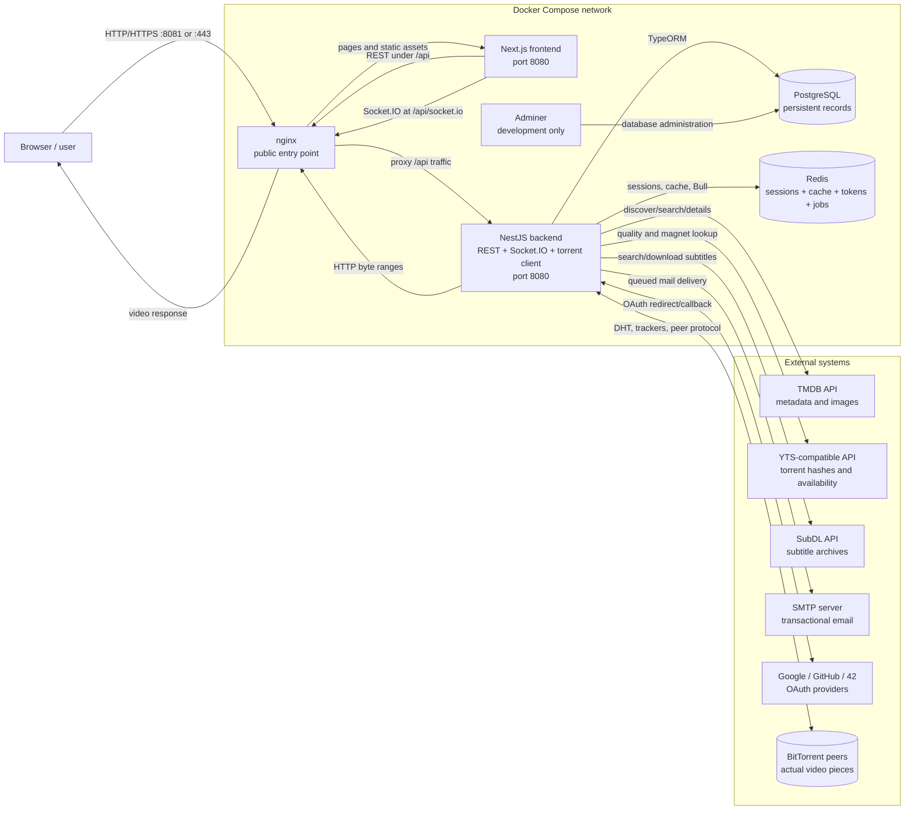
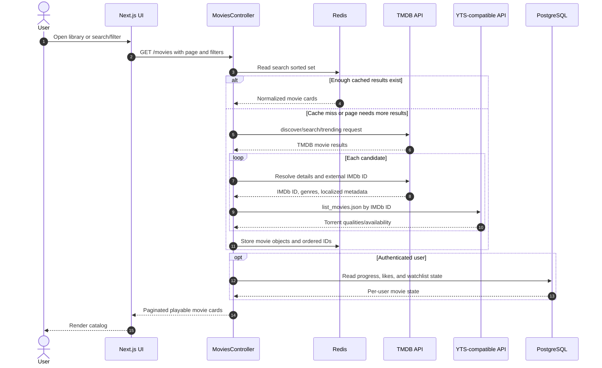
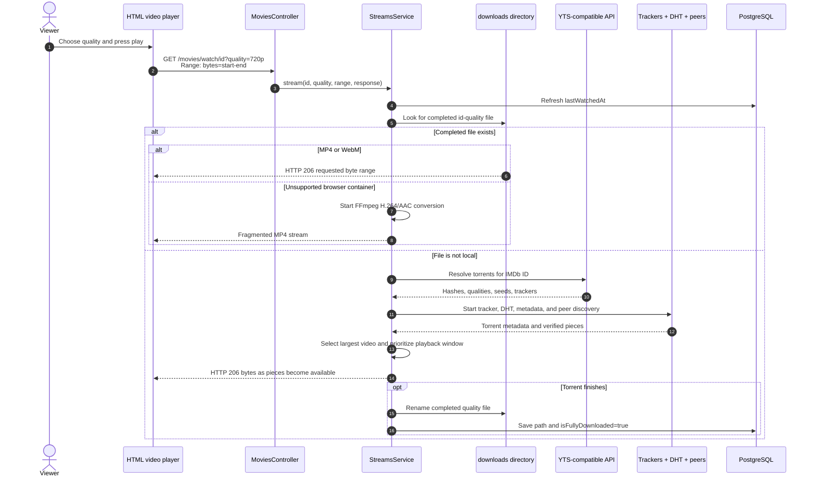
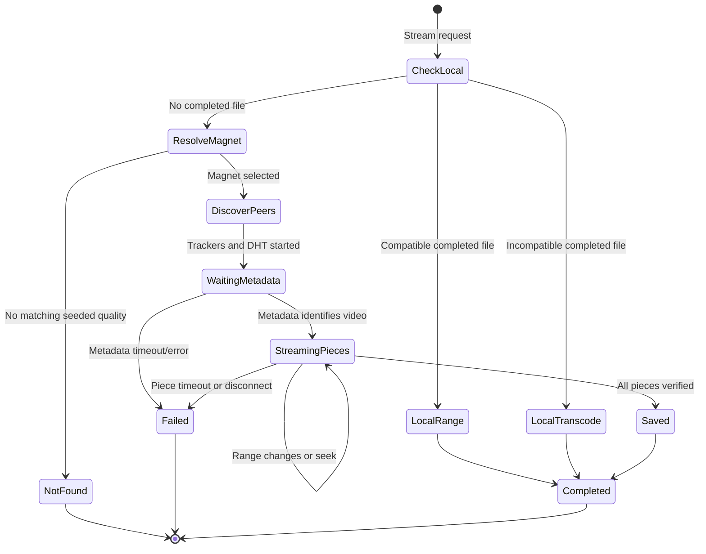
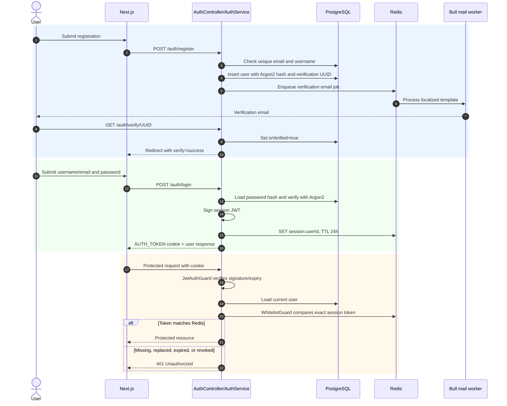
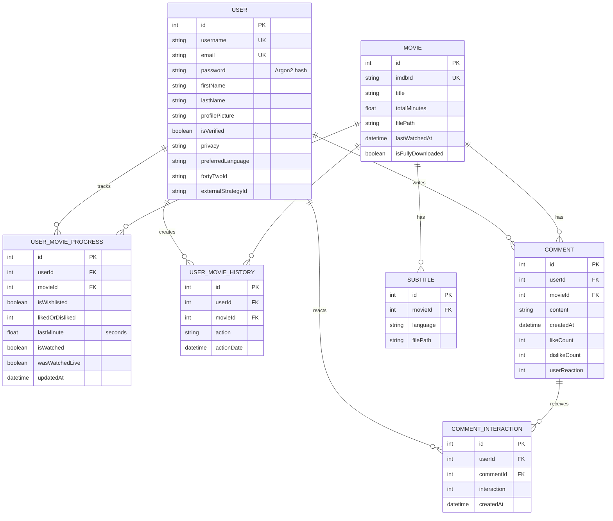

# Hypertube: Complete Application Guide

This document explains how the current Hypertube codebase works. It covers the
browser application, backend, authentication, movie discovery, torrent
streaming, subtitles, profiles, comments, watch progress, invitations, live
watch rooms, storage, caching, deployment, and the public API.

> **Content responsibility:** TMDB supplies metadata, not full movie files.
> Hypertube obtains playable media from other configured sources. Only use
> media that you are legally allowed to access and distribute.

## Contents

1. [What the application does](#1-what-the-application-does)
2. [Technology and services](#2-technology-and-services)
3. [Request flow](#3-request-flow)
4. [Where movies come from](#4-where-movies-come-from)
5. [How playback works](#5-how-playback-works)
6. [Subtitles](#6-subtitles)
7. [Authentication and sessions](#7-authentication-and-sessions)
8. [Profiles, privacy, and user data](#8-profiles-privacy-and-user-data)
9. [Watchlist, likes, comments, and history](#9-watchlist-likes-comments-and-history)
10. [Creating a watch room and sending an invite](#10-creating-a-watch-room-and-sending-an-invite)
11. [Redis usage](#11-redis-usage)
12. [PostgreSQL data model](#12-postgresql-data-model)
13. [REST API reference](#13-rest-api-reference)
14. [Frontend pages](#14-frontend-pages)
15. [Environment variables](#15-environment-variables)
16. [Running the application](#16-running-the-application)
17. [Development commands and important source files](#17-development-commands-and-important-source-files)
18. [Current operational limitations](#18-current-operational-limitations)

## 1. What the application does

Hypertube is a multilingual movie-discovery and streaming web application. A
user can:

- register with email/password or sign in through Google, GitHub, or 42;
- verify an email address and reset or change a password;
- browse trending and curated movies or search/filter the library;
- open a movie page containing metadata, cast, director, and comments;
- discover available torrent qualities and stream a selected quality;
- select subtitles supplied by SubDL;
- like/dislike a movie, add it to a watchlist, and view activity history;
- resume a partially watched movie;
- edit profile information, privacy, preferred language, and avatar;
- find another user and invite them to a synchronized two-person watch room;
- synchronize play, pause, and seek actions and exchange room chat messages;
- use a separate OAuth-style API token for integration endpoints.

The UI supports English (`en`), French (`fr`), and Arabic (`ar`) through
`next-intl`.

## 2. Technology and services

| Layer/service | Technology | Main responsibility |
|---|---|---|
| `web` | nginx | Entry point on `http://localhost:8081`; sends `/api/*` and Socket.IO traffic to the backend and other paths to Next.js. |
| `front` | Next.js, React, TypeScript | Pages, components, localization, Axios requests, TanStack Query hooks, Zustand user state, and Socket.IO client. |
| `back` | NestJS, TypeScript | REST API, Passport authentication, Socket.IO room events, movie-source integration, torrent streaming, subtitles, mail jobs, and persistence. |
| `database` | PostgreSQL + TypeORM | Users, locally referenced movies, comments, reactions, watch progress, and activity history. |
| `redis` | Redis | Sessions, movie/search caches, temporary invitation tokens, password/email-change tokens, and Bull mail jobs. |
| `adminer` | Adminer | Development database interface on `http://localhost:8080`. |

Development containers share the `hypertube` Docker network. The frontend and
backend both listen on port `8080` inside their own containers. nginx exposes
the application on host port `8081`. The backend additionally exposes TCP/UDP
`6881` and UDP `20000` for BitTorrent peer discovery and transfer.

## 3. Request flow



### 3.1 Ownership of state

Understanding where state lives is important when debugging:

| State | Owner | Lifetime |
|---|---|---|
| User, comments, progress, history, local movie rows | PostgreSQL | Persistent until explicitly removed. |
| Login session allow-list | Redis | 24 hours or logout/replacement. |
| Search/trending/movie-card cache | Redis | Usually 24 hours. |
| Password and profile-change tokens | Redis | One hour. |
| Pending watch invitation | Redis | 15 minutes or until accepted/declined. |
| Accepted room membership and connected sockets | NestJS process memory | Until abort/disconnect/restart. |
| Room chat messages | Browser component state | Until navigation/refresh. |
| Partial and complete torrent data | Backend `downloads/` | Partial session or up to cleanup of completed content. |

The frontend creates an Axios client whose base URL is
`NEXT_PUBLIC_BACK_API_URL`. In Docker development this comes from
`PUBLIC_API_URL`, normally `http://localhost:8081/api`. Axios sends cookies on
all requests, so the `AUTH_TOKEN` session cookie reaches the backend.

## 4. Where movies come from

There are two separate concepts: **movie information** and **the movie video**.

### 4.1 TMDB provides metadata only

The backend uses the TMDB v3 API configured by:

- `TMDB_API` — normally `https://api.themoviedb.org/3/`;
- `TMDB_PICS` — TMDB image base URL;
- `TMDB_KEY` — private TMDB API key.

TMDB supplies:

- trending/discover/search results;
- title, overview, release year, genres, runtime, and rating;
- poster and backdrop paths;
- cast and director information;
- a mapping between a TMDB ID and an IMDb ID.

TMDB does **not** return a full playable movie. The IMDb ID becomes the common
identifier used to connect TMDB metadata with torrent and subtitle results.

### 4.2 The YTS-compatible API provides torrent information

In normal mode, `LINK_API_MOVIES_LIST_YTS` points to a YTS-compatible API. The
currently configured development base URL is:

```text
https://movies-api.accel.li/api/v2/
```

Hypertube calls:

- `list_movies.json?query_term=<IMDb ID>` while building catalog cards, to
  determine whether a movie exists and show its best quality/size/audio data;
- `movie_details.json?imdb_id=<IMDb ID>` when listing playable qualities or
  preparing a stream, to obtain torrent hashes, seed counts, peer counts,
  language, quality, and size.

The backend converts a returned torrent hash into a magnet URI and appends a
tracker list. This API provides torrent metadata; the actual movie bytes come
from BitTorrent peers.

### 4.3 Catalog discovery flow

```text
1. Frontend requests /api/movies, /trending, /curated, or /popular_one.
2. Backend queries TMDB for candidate movies.
3. Backend normalizes each result and resolves its IMDb ID.
4. Backend asks the YTS-compatible API about torrent availability.
5. Results are cached in Redis.
6. Backend adds the current user's watchlist/like/progress state.
7. Frontend renders the cards and movie pages.
```

The same flow as a sequence diagram:



Filtering and pagination happen through `FilterMovieDto`. The backend creates a
cache key from query, genre, rating, year range, sort field, order, and language.
The Redis sorted set preserves display order, while individual
`movie:<IMDb ID>` keys hold normalized card data. When the requested page is not
fully cached, the backend advances through additional TMDB pages and enriches
the new results.

The full external catalog is not imported into PostgreSQL in advance. Redis
holds catalog/search data temporarily. A small `movie` record is created in
PostgreSQL only when application features need a local relation, such as a
comment, like/dislike, watchlist item, history entry, or watch progress.

### 4.4 Optional 42/content-source mode

The service contains an alternate mode selected by `FORTY_TWO_MODE`. It uses
Archive.org and SepiaSearch-style sources instead of the normal TMDB + YTS
catalog/stream path, with variables such as `ARCHIVE_URL`,
`ARCHIVE_DEFAULT_IMG`, `SEPIASEARCH_API_URL`, and `SEPIASEARCH_URL`.

The current implementation checks `!!process.env.FORTY_TWO_MODE`. Therefore,
**leave the variable completely unset for normal mode**. A string value such as
`FORTY_TWO_MODE=false` is still truthy in JavaScript and enables the alternate
mode.

## 5. How playback works

### 5.1 Preparing the player

When a user opens `/[locale]/watch/<IMDb ID>`, the frontend requests:

1. `GET /api/movies/<IMDb ID>` for metadata and personal progress;
2. `GET /api/movies/qualities/<IMDb ID>` for seeded qualities;
3. `GET /api/movies/subtitles/<IMDb ID>` for available subtitles.

The player prefers `720p` when available; otherwise it uses the first returned
quality. Its video source is:

```text
GET /api/movies/watch/<IMDb ID>?quality=<quality>
```

The HTML `<video>` element sends byte-range requests. nginx proxies them to the
NestJS endpoint with the session cookie.

### 5.2 Torrent-to-HTTP streaming

For a new stream, the backend:

1. checks `downloads/` for an already completed file of the requested quality;
2. asks the YTS-compatible API for torrents matching the IMDb ID;
3. selects the requested quality only when it has at least one reported seed;
4. parses the magnet metadata and identifies the largest supported video file;
5. discovers peers through trackers, DHT, and peer exchange;
6. requests and verifies torrent pieces, prioritizing the playback window;
7. returns those bytes as an HTTP range response to the browser;
8. moves a completed download to `downloads/<imdbId>-<quality>.<extension>`;
9. records the local path and completion state in PostgreSQL.





If a completed local file exists, later requests are served directly from disk.
The scheduled cleanup runs every midnight and removes fully downloaded movie
files that have not been watched for 30 days. This clears the stored file path
and completion flag but keeps the movie database record.

Browser-native formats include MP4 and WebM. The stream service also recognizes
other common container formats and contains conversion/transcoding support for
cases where direct browser playback is unsuitable.

The most common playback failures are: no torrent for the IMDb ID, no seeds for
the selected quality, failure to obtain torrent metadata, a peer-piece timeout,
or FFmpeg not being available for a non-MP4/WebM source. A `404` from the
qualities endpoint means the metadata may exist in TMDB but no currently seeded
configured source was found.

### 5.3 Watch progress

The frontend reports the current video time every five seconds through the
authenticated Socket.IO connection. It also sends updates on play and pause.
The backend creates the local movie entry if necessary and stores
`lastMinute` (despite its name, the value is seconds) in `user_movie_progress`.

A movie becomes watched after reaching 80% of its stored runtime. The profile's
“Continue watching” section returns up to ten incomplete movies with progress,
ordered by the most recent update.

## 6. Subtitles

Subtitles use the SubDL API:

- `SUBDL_API_URL` and `SUBDL_API_KEY` search by IMDb ID;
- `SUBDL_DWN_URL` downloads the selected subtitle archive.

`GET /api/movies/subtitles/<IMDb ID>` returns unique languages and frontend
links. Results are cached in Redis. When the player requests one of those
links, the backend downloads the ZIP archive, extracts the first `.srt`, `.vtt`,
or `.ass` file, and stores it under `downloads/`. SRT timestamps are converted
to WebVTT syntax before being returned as `text/vtt`. The user's preferred
language is marked as the default `<track>` when available.

## 7. Authentication and sessions

### 7.1 Local registration

`POST /api/auth/register` accepts:

```json
{
  "username": "alice",
  "email": "alice@example.com",
  "password": "StrongPass1",
  "firstName": "Alice",
  "lastName": "Example"
}
```

Usernames and emails must be unique. Passwords require at least eight
characters, uppercase and lowercase characters, and a number or special
character. The `User` entity hashes passwords with Argon2 before insert/update.

Registration creates a UUID verification token and queues a localized email
through Bull/Redis. Clicking `/api/auth/verify/<token>` marks the account as
verified and redirects to the frontend with a success/failure query parameter.
Verified routes reject unverified local users.

### 7.2 Login and session validation

`POST /api/auth/login` accepts a username or email plus password through the
Passport local strategy. On success:

- NestJS signs a JWT containing user ID and username;
- Redis stores it as `session:<userId>` for 24 hours;
- the response sets `AUTH_TOKEN`, expiring after one day;
- the frontend receives both the token and user data.

JWT extraction supports either the `AUTH_TOKEN` cookie or an
`Authorization: Bearer <token>` header. `JwtAuthGuard` verifies the signature
and loads the user. `WhitelistGuard` additionally requires the exact token to
still exist in Redis, which makes logout/session revocation effective.

`POST /api/auth/logout` deletes the Redis session and clears the cookie.



Guard composition differs by endpoint. `VerifiedGuard` checks the database user
flag but does not itself check the Redis allow-list. Routes using
`WhitelistGuard` require the current Redis session and reject an older token
after a second login. Socket.IO uses `WsJwtGuard`; it validates the JWT and puts
the authenticated user ID into the socket handshake data used by room checks.

> Current security note: the source intentionally leaves `httpOnly` commented
> out on the cookie because the Socket.IO client reads it in JavaScript. In a
> hardened design, prefer an HttpOnly session cookie and provide WebSocket
> authentication without exposing the JWT to browser scripts.

### 7.3 OAuth login

Google, GitHub, and 42 use Passport OAuth strategies:

```text
/api/auth/login/google  -> /api/auth/login/google/callback
/api/auth/login/github  -> /api/auth/login/github/callback
/api/auth/login/42      -> /api/auth/login/42/callback
```

The callback creates or loads a verified user, creates the same JWT/Redis
session, sets `AUTH_TOKEN`, and redirects to `/auth/callback` on the frontend.
Each provider requires its client ID, client secret, and callback URL variables.

### 7.4 Resetting or changing credentials

- `POST /api/auth/request-reset-password` creates a Redis token valid for one
  hour and queues a reset email.
- `POST /api/auth/reset-password` validates that token and saves the new
  Argon2-hashed password.
- Updating an email or password through `PATCH /api/users/me` does not apply it
  immediately. A one-hour Redis token is emailed first; the corresponding
  verification route applies the change.

### 7.5 Session routes versus API integration routes

There are two deliberately different token types:

- **Application session JWT:** created by normal/OAuth login and accepted by
  movie, profile, room, and interactive UI routes.
- **API-scope Bearer JWT:** obtained from `POST /api/oauth/token`; its payload
  contains `scope: "api"` and it is accepted only by `ApiScopeGuard` routes.

Application routes reject API-scope tokens, and API integration routes reject
regular session tokens. Configure `OAUTH_CLIENT_ID` and `OAUTH_CLIENT_SECRET`;
do not rely on the development fallback credentials in production.

## 8. Profiles, privacy, and user data

An authenticated user can update first/last name, username, preferred language,
privacy, profile image reference, email, and password. Email/password changes
require the confirmation flow described above.

Avatar uploads:

- use multipart field `file`;
- accept JPEG/JPG/PNG only;
- have a 5 MiB maximum size;
- are stored in the backend `uploads/` directory;
- are served through the guarded avatar endpoint.

Profile summaries calculate watched, wishlisted, liked, disliked, total
interactions, watched minutes, and activity history. A private profile is not
returned to another user by `findById`; the owner can always view their own
profile. User search omits the requesting user and exposes public-facing fields.

## 9. Watchlist, likes, comments, and history

`user_movie_progress` has one row per user/movie and stores:

- `isWishlisted`;
- `likedOrDisliked` (`0` neutral, `1` liked, `2` disliked);
- `lastMinute` playback position in seconds;
- `isWatched`;
- `wasWatchedLive`;
- the last update timestamp.

Watchlist and interaction changes also append human-readable actions to
`user_movie_history`. Watchlist caches are invalidated for English, French, and
Arabic when the state changes.

Comments belong to both a user and a local movie record. Users can post movie
comments and like/dislike them. Comment interactions are kept separately so a
user's reaction can be tracked while aggregate like/dislike counts remain on
the comment.

The API-scope comment endpoints support listing, creating, editing, and deleting
comments for external integrations. Session endpoints support the website UI.

## 10. Creating a watch room and sending an invite

This implementation is a synchronized two-person room. It uses Socket.IO, not
WebRTC. Both users independently load the same backend HTTP stream; Socket.IO
synchronizes controls and relays chat.

### 10.1 Invitation flow

```text
Host opens a movie -> clicks Live Invite -> enters username/email
  |
  v
POST /api/movies/invite/<imdbId>
  body: { "title": "...", "userInput": "username-or-email" }
  |
  |-- backend verifies recipient exists and is not the host
  |-- creates UUID and stores invite:<guest>:<movie>:<host> in Redis (15 min)
  |-- queues localized email with Accept and Decline links
  `-- returns UUID token; host waits for INVITE_ACCEPTED

Guest clicks Accept
  |
  v
GET /api/movies/invite/<uuid>?accept=true
  |
  |-- requires the invited user's active session
  |-- deletes the one-time Redis invitation
  |-- registers host + guest against the UUID room in backend memory
  |-- emits INVITE_ACCEPTED to the host
  `-- redirects guest to /watch/<imdbId>?token=<uuid>

Host receives INVITE_ACCEPTED
  `-- navigates to the same /watch/<imdbId>?token=<uuid>
```

```mermaid
sequenceDiagram
    autonumber
    actor Host
    actor Guest
    participant HostUI as Host browser
    participant API as NestJS movies API
    participant Redis
    participant Mail as Mail queue + SMTP
    participant Socket as /movie Socket.IO gateway
    participant GuestUI as Guest browser

    Host->>HostUI: Click Live Invite and enter guest username/email
    HostUI->>API: POST /movies/invite/imdbId
    API->>API: Find guest and reject self-invite
    API->>Redis: Check invite:guest:movie:host
    alt Existing unexpired invitation
        Redis-->>API: Existing UUID
        API-->>HostUI: Return same room token
    else New invitation
        API->>Redis: Store UUID with 900-second TTL
        API->>Mail: Queue localized invite
        Mail-->>Guest: Email Accept and Decline links
        API-->>HostUI: Return UUID; enter waiting screen
    end

    Guest->>API: GET /movies/invite/UUID?accept=true
    API->>API: Authenticate active guest session
    API->>Redis: Find and validate invitation owner
    Redis-->>API: guestId, movieId, hostId
    API->>Redis: Delete one-time invitation
    API->>Socket: Register host + guest for UUID room
    Socket-->>HostUI: INVITE_ACCEPTED with roomId
    API-->>GuestUI: Redirect /watch/movieId?token=UUID
    HostUI->>HostUI: Navigate /watch/movieId?token=UUID

    HostUI->>Socket: join_room UUID
    GuestUI->>Socket: join_room UUID
    Socket-->>HostUI: USER_JOINED
    Socket-->>GuestUI: USER_JOINED

    par Playback synchronization
        HostUI->>Socket: start_stream / pause_stream / seek_stream
        Socket-->>GuestUI: START_STREAM / PAUSE_STREAM / SEEK_STREAM
    and Ephemeral chat
        GuestUI->>Socket: send_message
        Socket-->>HostUI: MESSAGE
    and Independent video delivery
        HostUI->>API: GET /movies/watch/movieId
        GuestUI->>API: GET /movies/watch/movieId
    end
```

Declining calls the same endpoint with `accept=false`, consumes the invitation,
and does not create a room. Re-sending the same invitation during its lifetime
returns the existing token instead of producing another email/token.

Because the invitation endpoint is authenticated, a guest who is not logged in
must log in as the invited account before accepting. The UUID is both the
invitation token and room ID.

### 10.2 Socket connection and room membership

The frontend opens Socket.IO at:

```text
<NEXT_PUBLIC_SOCKET_URL>/movie
path: /api/socket.io
Authorization: Bearer <AUTH_TOKEN>
```

The WebSocket JWT guard validates the user and stores the user ID on the socket.
Only the exact host and guest registered for that room may join. When both have
joined, each receives `USER_JOINED` and the watch-party UI becomes active.

Rooms and joined sockets are currently stored in process memory. They do not
survive a backend restart and are not shared between multiple backend replicas.
The invitation itself is in Redis, but the accepted room membership is not.

### 10.3 Room events

| Client emits | Other client receives | Purpose |
|---|---|---|
| `join_room` | `USER_JOINED` (both) | Join the accepted UUID room. |
| `send_message` | `MESSAGE` | Relay ephemeral two-person chat. |
| `start_stream` | `START_STREAM` | Start/play the other player's video. |
| `pause_stream` | `PAUSE_STREAM` | Pause the other player's video. |
| `seek_stream` | `SEEK_STREAM` | Move the other player to a timestamp. |
| `abort_stream` | `ABORT_STREAM` | Stop and remove in-memory room state. |
| `play`, `pause`, `heartbeat`, `seeking` | no room broadcast | Save the sender's personal progress. |

Room chat is ephemeral: it exists only in the two browsers and is not written
to PostgreSQL or Redis.

There is no explicit `create_room` socket event. The room becomes eligible when
the guest accepts the REST invitation and `notifyHostInviteAccepted` populates
the gateway's in-memory host/guest map. Passing an arbitrary `?token=` value is
not enough: `join_room` checks that the authenticated socket user is one of the
two IDs registered for that UUID.

## 11. Redis usage

Redis is important even though PostgreSQL is the primary database. It stores:

- one active session token per user (`session:<id>`);
- search result sorted sets and normalized movie objects;
- trending, hero, curated, wishlist, and metadata caches;
- subtitle search data;
- one-hour reset/email/password-change tokens;
- 15-minute watch invitation tokens;
- Bull's `mail-queue` jobs.

Catalog caching reduces repeated calls to TMDB and the YTS-compatible API.
Restarting/clearing Redis logs users out and clears temporary tokens and cached
catalog data, but does not delete PostgreSQL records.

The Redis wrapper passes all durations to the Redis `EX` option, so values are
seconds. Important current TTLs are:

| Key pattern | TTL | Meaning |
|---|---:|---|
| `session:<userId>` | 86,400 s (24 h) | Current UI or API token allowed for that user. |
| `movie:<id>`, search sorted sets, page counters | 86,400 s (24 h) | Normalized catalog and pagination state. |
| `hero<language>` | 86,400 s (24 h) | Candidate hero movies. |
| `curated_trending_top_24_<language>` | 86,400 s (24 h) | Four curated homepage movies. |
| `subtitles:<imdbId>` | 36,000 s (10 h) | SubDL results including private download path. |
| `invite:<guest>:<movie>:<host>` | 900 s (15 min) | One-time watch invitation UUID. |
| `passwordReset:<userId>` | 3,600 s (1 h) | Password recovery UUID. |
| `emailChangeToken:<userId>` | 3,600 s (1 h) | Pending email and confirmation UUID. |
| `passwordChange:<userId>` | 3,600 s (1 h) | Pending password and confirmation UUID. |
| `metadata:<id>` | 600,000 s (about 6.9 days) | TMDB-to-IMDb enrichment. |

The `metadata` duration is notably much longer than the other movie caches. If
`600000` was intended as milliseconds, it should be changed because Redis `EX`
interprets it as seconds.

## 12. PostgreSQL data model

| Entity | Important stored data |
|---|---|
| `User` | Credentials, names, avatar, verification state, privacy, language, and OAuth provider IDs. |
| `Movie` | IMDb ID, title, runtime, downloaded file path, last watched time, and fully-downloaded flag. |
| `UserMovieProgress` | Per-user movie reactions, watchlist state, progress, watched state, and live-watch state. |
| `UserMovieHistory` | Timestamped actions such as liked, disliked, watched, or watchlist changes. |
| `Comment` | Text, author, movie, timestamp, and reaction totals. |
| `CommentCommentInteraction` | One user's reaction to one comment. |
| `Subtitle` | Local subtitle language/path linked to a movie. |



TypeORM synchronization is disabled. Schema changes must use migrations. The
development backend startup script runs pending migrations before starting
NestJS.

## 13. REST API reference

All paths below are shown after nginx's `/api` prefix.

Guard labels:

- **Public**: no JWT required.
- **Optional session**: works anonymously but adds user-specific data with a
  valid session.
- **Verified session**: normal JWT and verified account required.
- **Active session**: normal JWT must match the current Redis session.
- **API token**: only a Bearer JWT with `scope=api` is accepted.

### Authentication

| Method | Route | Guard | Purpose |
|---|---|---|---|
| POST | `/auth/register` | Public | Create a local user and send verification mail. |
| POST | `/auth/login` | Local credentials | Create JWT, Redis session, and cookie. |
| POST | `/auth/request-reset-password` | Public | Email a one-hour reset token. |
| POST | `/auth/reset-password` | Public + token | Apply a new password. |
| GET | `/auth/login/google` | Public | Begin Google OAuth. |
| GET | `/auth/login/google/callback` | Provider callback | Complete Google OAuth. |
| GET | `/auth/login/github` | Public | Begin GitHub OAuth. |
| GET | `/auth/login/github/callback` | Provider callback | Complete GitHub OAuth. |
| GET | `/auth/login/42` | Public | Begin 42 OAuth. |
| GET | `/auth/login/42/callback` | Provider callback | Complete 42 OAuth. |
| GET | `/auth/verify/:token` | Public + token | Verify registration email. |
| GET | `/auth/verify-email-change/:token` | Verified session | Confirm email change. |
| GET | `/auth/change-password/:token` | Verified session | Confirm profile password change. |
| GET | `/auth/whois` | Active session | Return current user. |
| POST | `/auth/logout` | Active session | Revoke session and clear cookie. |
| POST | `/oauth/token` | Client credentials | Create 24-hour API-scope Bearer token. |

### Movies and rooms

| Method | Route | Guard | Purpose |
|---|---|---|---|
| GET | `/movies` | Verified session | Search/filter/paginate the library; without filters returns a compact trending list. |
| GET | `/movies/popular_one` | Public | Random hero movie from a cached trending selection. |
| GET | `/movies/curated` | Public | Up to four curated weekly trending movies with playable quality. |
| GET | `/movies/trending` | Active session | Paginated trending movies plus user state. |
| GET | `/movies/wishlist` | Active session | Current user's paginated watchlist. |
| POST | `/movies/interaction/:imdbId` | Active session | Toggle like/dislike/neutral state. |
| POST | `/movies/wishlist/:imdbId` | Active session | Toggle watchlist state. |
| GET | `/movies/subtitles/:imdbId` | Active session | Search available subtitles. |
| GET | `/movies/subtitle_file/:imdbId?language=...` | Active session | Download/convert and return subtitle track. |
| GET | `/movies/qualities/:imdbId` | Active session | Return seeded playable qualities. |
| GET | `/movies/watch/:id?quality=...` | Active session | Return the video as HTTP range data. |
| POST | `/movies/:imdbId/progress` | Active session | Save `seconds` and `isLive`. |
| GET | `/movies/:imdbId` | Verified session | Return metadata, credits, comments count, and personal state. |
| POST | `/movies/invite/:imdbId` | Active session | Email a 15-minute two-person invitation. |
| GET | `/movies/invite/:uuid?accept=true|false` | Active session | Accept/decline an invitation and redirect. |
| GET | `/movies/:imdbId/comments` | Optional session | Return paginated movie comments. |
| POST | `/movies/:imdbId/comments` | Active session | Create a movie comment. |

### Comments

| Method | Route | Guard | Purpose |
|---|---|---|---|
| GET | `/comments` | Public | Latest comments. |
| GET | `/comments/:id` | Optional session | Numeric ID returns one comment; otherwise treats it as a movie ID. |
| POST | `/comments` | API token | Create a comment using integration field aliases. |
| PATCH | `/comments/:id` | API token | Update a comment. |
| DELETE | `/comments/:id` | API token | Delete a comment. |
| POST | `/comments/:imdbId` | Active session | Create a website movie comment. |
| POST | `/comments/interaction/:commentId` | Active session | Like, dislike, or clear a comment reaction. |

### Users and documentation

| Method | Route | Guard | Purpose |
|---|---|---|---|
| GET | `/users` | API token | List users for an integration. |
| PATCH | `/users/me` | Active session | Update the current profile. |
| GET | `/users/me/summary` | Active session | Own profile stats and history. |
| GET | `/users/:id/summary` | Active session | Another visible user's profile stats/history. |
| GET | `/users/me/continue-watching` | Active session | Up to ten incomplete movies. |
| GET | `/users/find/users` | Active session | Paginated user search. |
| POST | `/users/avatar_update` | Active session | Upload JPEG/PNG avatar, maximum 5 MiB. |
| GET | `/users/avatar/:filename` | Active session | Return an uploaded avatar. |
| GET | `/users/:id` | API token | Get an integration-facing user profile. |
| PATCH | `/users/:id` | API token | Update an integration-facing profile. |
| GET | `/docs/` | Public | Return backend documentation JSON. |

## 14. Frontend pages

Every page is locale-prefixed, for example `/en/library`, `/fr/profile`, or
`/ar/movie/tt1234567`.

| Page | Purpose |
|---|---|
| `/` | Hero, curated movies, and continue-watching section. |
| `/login`, `/register` | Local and OAuth authentication UI. |
| `/reset-password-email`, `/reset-password` | Password recovery. |
| `/auth/callback` | Completes frontend handling after OAuth redirect. |
| `/library` | Searchable/filterable movie catalog. |
| `/trending` | Paginated trending catalog. |
| `/search` | Movie search UI; also implemented as an intercepted modal route. |
| `/movie/:id` | Movie details, cast, reactions, comments, sharing, and invitation action. |
| `/watch/:id` | Solo player or synchronized room when `?token=<uuid>` is present. |
| `/watchlist` | Saved movies. |
| `/history` | Interaction/watch activity. |
| `/profile` | Own profile settings and statistics. |
| `/profile/:id` | Another user's visible profile. |
| `/search/users/:id` | User-search result/profile flow. |
| `/docs` | UI for the backend API documentation. |

## 15. Environment variables

Never commit real secrets. Development uses `.env.dev`; production Compose
uses `.env.prod`.

| Group | Variables |
|---|---|
| PostgreSQL | `POSTGRES_HOST`, `POSTGRES_PORT`, `POSTGRES_USER`, `POSTGRES_PASSWORD`, `POSTGRES_DB` |
| Redis | `REDIS_HOST`, `REDIS_PORT`, `REDIS_URL` |
| Application | `PORT`, `NODE_ENV`, `JWT_SECRET`, `PUBLIC_API_URL`, `FRONTEND_URL` |
| Movie metadata | `TMDB_API`, `TMDB_PICS`, `TMDB_KEY` |
| Torrent lookup | `LINK_API_MOVIES_LIST_YTS` |
| Subtitles | `SUBDL_API_KEY`, `SUBDL_API_URL`, `SUBDL_DWN_URL` |
| Mail | `MAIL_SERVER`, `MAIL_PORT`, `MAIL_USERNAME`, `MAIL_PASSWORD`, `MAIL_DEFAULT_SENDER` |
| 42 OAuth | `FORTY_TWO_CLIENT_ID`, `FORTY_TWO_CLIENT_SECRET`, `FORTY_TWO_CALL_BACK` |
| Google OAuth | `GOOGLE_CLIENT_ID`, `GOOGLE_CLIENT_SECRET`, `GOOGLE_CALL_BACK` |
| GitHub OAuth | `GITHUB_CLIENT_ID`, `GITHUB_CLIENT_SECRET`, `GITHUB_CALL_BACK` |
| Integration API | `OAUTH_CLIENT_ID`, `OAUTH_CLIENT_SECRET` |
| Alternate content mode | `FORTY_TWO_MODE`, `ARCHIVE_URL`, `ARCHIVE_DEFAULT_IMG`, `SEPIASEARCH_API_URL`, `SEPIASEARCH_URL` |
| Optional WebRTC config | `NEXT_PUBLIC_STUN_URLS`, `NEXT_PUBLIC_TURN_URLS`, `NEXT_PUBLIC_TURN_USER`, `NEXT_PUBLIC_TURN_PASS` |

The current room implementation does not create an `RTCPeerConnection`, so
STUN/TURN variables do not participate in the active watch-room flow.

Recommended development URL values are:

```dotenv
PUBLIC_API_URL=http://localhost:8081/api
FRONTEND_URL=http://localhost:8081
TMDB_API=https://api.themoviedb.org/3/
TMDB_PICS=https://image.tmdb.org/t/p/original/
LINK_API_MOVIES_LIST_YTS=https://movies-api.accel.li/api/v2/
```

`TMDB_KEY`, OAuth secrets, SMTP credentials, `JWT_SECRET`, `SUBDL_API_KEY`, and
integration credentials must be supplied privately.

## 16. Running the application

### Prerequisites

- Docker Engine with the Docker Compose v2 plugin;
- access to the configured external APIs;
- valid TMDB, mail, subtitle, and OAuth credentials for the features you use.

### Development

The Makefile uses `ENV=dev` by default:

```bash
make                 # build and start detached
make ps              # list container status
make history         # follow logs
make down            # stop containers
```

Equivalent direct command:

```bash
docker compose -f docker-compose.dev.yml --env-file .env.dev up --build -d
```

Open:

- application: `http://localhost:8081`;
- backend through nginx: `http://localhost:8081/api`;
- Adminer: `http://localhost:8080`.

The development startup scripts run `npm install` inside the mounted source
directories. The backend runs pending migrations and starts with Nodemon; the
frontend starts the Next.js development server on `0.0.0.0:8080`.

`make clean` removes the Compose volumes associated with the selected file.
`make fclean` additionally prunes all unused Docker images, containers,
networks, and volumes on the machine, so use it carefully.

### Production

```bash
make ENV=prod
```

or:

```bash
docker compose -f docker-compose.prod.yml --env-file .env.prod up --build -d
```

Production exposes nginx on HTTPS port `443`, persists PostgreSQL and Redis
through volumes, builds the Next.js and NestJS applications, and creates a
self-signed certificate when no certificate exists. Replace that certificate
with a trusted certificate for a public deployment.

## 17. Development commands and important source files

Backend commands from `srcs/backend/`:

```bash
npm run build
npm run start:dev
npm test
npm run test:e2e
npm run migration:generate -- src/migrations/Name
npm run migration:run:dev
```

Frontend commands from `srcs/frontend/`:

```bash
npm run dev
npm run build
npm run lint
```

Important implementation locations:

- `srcs/backend/src/auth/` — local/OAuth login, JWT, guards, and tokens;
- `srcs/backend/src/movies/movies.service.ts` — catalog APIs, movie details,
  torrent lookup, subtitles, interactions, progress, history, and invites;
- `srcs/backend/src/streams/streams.service.ts` — BitTorrent peer protocol,
  range streaming, local files, and cleanup;
- `srcs/backend/src/movies/movies.gateway.ts` — authenticated Socket.IO room
  membership, synchronized controls, chat, and progress events;
- `srcs/backend/src/users/` — profiles, privacy, avatars, statistics, and search;
- `srcs/backend/src/comments/` — comments and reactions;
- `srcs/backend/src/mails/` — Bull mail producers, processor, and templates;
- `srcs/frontend/lib/services/` — frontend REST client wrappers;
- `srcs/frontend/app/context/SocketContext.tsx` — authenticated Socket.IO client;
- `srcs/frontend/app/components/layout/videoSection.tsx` — video player,
  qualities, subtitles, range URL, and progress heartbeat;
- `srcs/frontend/app/components/layout/watchPartySection.tsx` — synchronized
  room UI and ephemeral chat;
- `docker-compose.dev.yml`, `docker-compose.prod.yml`, and `Makefile` — runtime
  orchestration.

## 18. Current operational limitations

- Movie availability depends on the configured third-party APIs and on active
  torrent seeders; a TMDB result is not necessarily playable.
- Initial playback may take time while torrent metadata and pieces arrive.
- Only one Redis session token is stored per user, so a new login replaces the
  previously whitelisted session.
- Accepted rooms are in one backend process's memory. Horizontal scaling needs
  shared room state and a Socket.IO Redis adapter before it is reliable.
- Room chat is not persisted.
- Download and upload directories are not mounted as persistent volumes in the
  development Compose file, although the bind-mounted backend directory may
  preserve them depending on the working directory.
- Public hero/curated endpoints can still fail when external APIs are missing
  or rate-limited.
- The frontend middleware currently has protected-route enforcement disabled;
  backend guards remain the real authorization boundary.
- The session cookie is readable by JavaScript because `httpOnly` is disabled.
- The alternate mode uses a truthiness check, so `FORTY_TWO_MODE=false` still
  enables it; omit the variable to disable that mode.

These limitations describe the code as it exists today and are useful starting
points for production hardening.
